Lógica General del Sistema - AgriSphere

El proyecto AgriSphere es una plataforma integral de gestión y control de acceso agrícola. La arquitectura está dividida en dos componentes principales:

Backend: API REST desarrollada en Python con FastAPI.

Frontend / Mobile: Aplicación nativa desarrollada en Android (Kotlin).

El sistema garantiza la seguridad y la trazabilidad de las operaciones en campo a través de tokens de sesión y validaciones criptográficas de códigos QR dinámicos.

Flujos de Usuario Principales

1. Perfil Empleado

Autenticación: El empleado inicia sesión con sus credenciales en la App.

Seguridad JWT: El backend de FastAPI valida los datos y devuelve un token JWT con vigencia de 24 horas.

Almacenamiento Local: La aplicación de Android almacena el token de forma segura utilizando SharedPreferences.

Gafete Digital: La pantalla principal de la App consume el perfil del trabajador y renderiza un código QR dinámico y cifrado (con firma temporal anti-falsificación) para su identificación en campo.

2. Perfil Encargado / Jefe de Área 

Escáner de Acceso: Utiliza la cámara en la App móvil para fungir como punto de control y escanear el Gafete Digital (QR) de los empleados.

Validación Criptográfica: La App envía la firma del QR al backend (FastAPI) para validar la autenticidad y los permisos de acceso del trabajador en tiempo real.

Panel de Control (BFF): Una vez autorizado un acceso u operación, el encargado es redirigido al Dashboard Principal de Sanidad Vegetal.

Gestión Operativa: Desde el Dashboard, el encargado puede visualizar el estado de los invernaderos en tiempo real y registrar incidencias críticas (plagas, insectos benéficos, focos de infección).

```mermaid
graph LR
    %% Configuración base para mejorar legibilidad de las líneas
    %%{init: {'theme': 'base', 'themeVariables': { 'lineColor': '#888888', 'textColor': '#000000'}}}%%

    %% ==========================================
    %% 1. JERARQUÍA DE ROLES (IZQUIERDA)
    %% ==========================================
    subgraph ROLES [" Jerarquía de Organización"]
        DR["Director Regional"]
        AS["Asesor / Operativo"]
        RH["Recursos Humanos"]
        JA["Jefe de Área"]
        EM["Empleado de Campo"]
    end

    DR -.->|Supervisa| AS
    AS -.->|Configura| RH
    RH -.->|Gestiona| JA
    JA -.->|Controla a| EM

    %% ==========================================
    %% 2. TECNOLOGÍA (CENTRO Y DERECHA)
    %% ==========================================
    subgraph APP [" App Nativa (Android/Kotlin)"]
        LOGIN["Pantalla Login"]
        GAFETE["Gafete Digital (QR)"]
        ESCANER["Escáner de Control"]
        DASH["Dashboard Sanidad"]
    end

    subgraph BACKEND [" Backend & Base de Datos"]
        AUTH["Módulo Auth (JWT)"]
        QR_API["Validación Criptográfica"]
        BFF["Endpoint BFF"]
        DATABASE[("PostgreSQL")]
    end

    %% ==========================================
    %% 3. FLUJOS DE INTERACCIÓN
    %% ==========================================
    
    %% Flujo 1: Empleado
    EM ==>|1. Inicia Sesión| LOGIN
    LOGIN -- "2. Valida" --> AUTH
    AUTH -- "3. Emite JWT 24h" --> LOGIN
    LOGIN -. "4. Muestra" .-> GAFETE

    %% Flujo 2: Jefe de Área / Encargado
    JA ==>|5. Activa cámara| ESCANER
    ESCANER -. "6. Lee QR" .-> GAFETE
    ESCANER -- "7. Envía firma" --> QR_API
    QR_API -- "8. Autoriza" --> DASH
    DASH -- "9. GET /resumen" --> BFF
    BFF -- "10. Consulta" --> DATABASE
    DATABASE -- "11. JSON unificado" --> BFF

    %% ==========================================
    %% ESTILOS VISUALES
    %% ==========================================
    
    %% Colores de Roles (Fondo pastel, texto negro)
    style DR fill:#b2dfdb,stroke:#004d40,color:#000,stroke-width:2px
    style AS fill:#e1f5fe,stroke:#0288d1,color:#000,stroke-width:2px
    style RH fill:#e8f5e9,stroke:#388e3c,color:#000,stroke-width:2px
    style JA fill:#fff3e0,stroke:#f57c00,color:#000,stroke-width:2px
    style EM fill:#f3e5f5,stroke:#7b1fa2,color:#000,stroke-width:2px

    %% Colores de Tecnología (Fondo oscuro, texto blanco)
    style APP fill:#2d3748,stroke:#48bb78,stroke-width:2px,color:#fff
    style BACKEND fill:#2d3748,stroke:#ed8936,stroke-width:2px,color:#fff
    style DATABASE fill:#4299e1,stroke:#2b6cb0,stroke-width:2px,color:#fff
    style LOGIN fill:#4a5568,color:#fff,stroke:#fff
    style GAFETE fill:#4a5568,color:#fff,stroke:#fff
    style ESCANER fill:#4a5568,color:#fff,stroke:#fff
    style DASH fill:#4a5568,color:#fff,stroke:#fff
    style AUTH fill:#4a5568,color:#fff,stroke:#fff
    style QR_API fill:#4a5568,color:#fff,stroke:#fff
    style BFF fill:#4a5568,color:#fff,stroke:#fff
```

